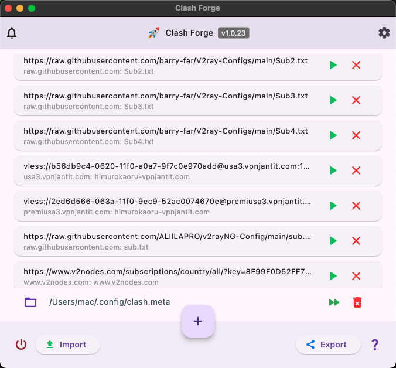
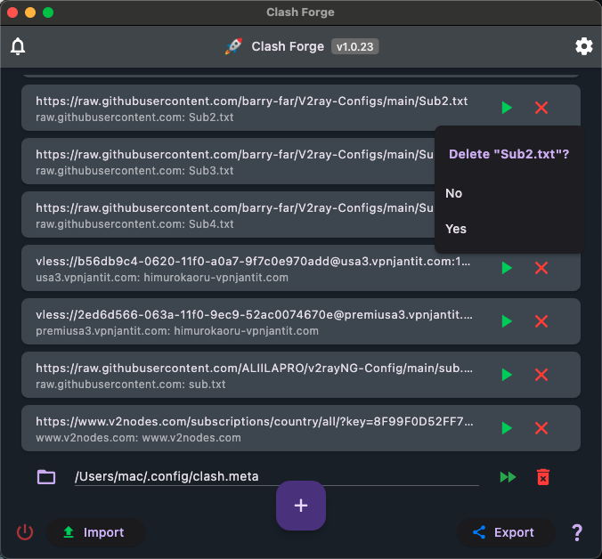
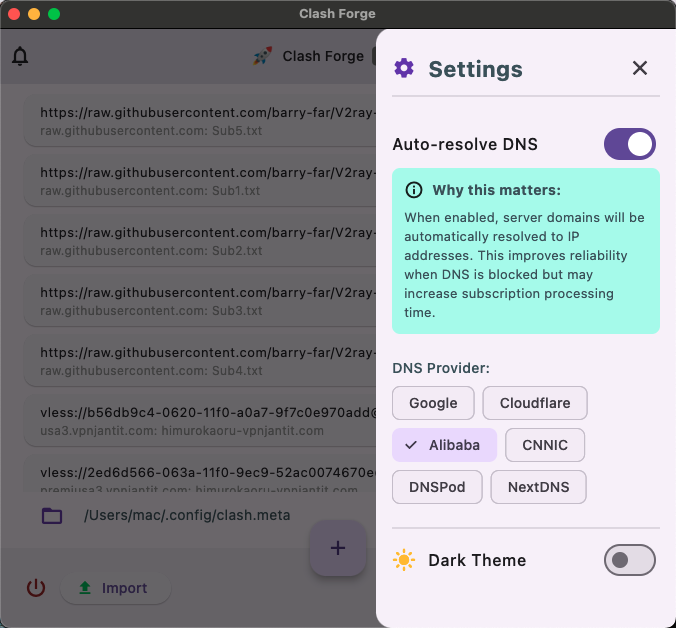
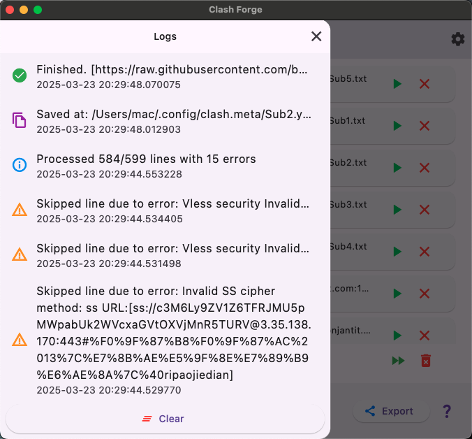

# Clash Forge

**Clash Forge** is a powerful and user-friendly tool designed to streamline the management of proxy configurations for [Clash], a popular rule-based proxy client. Whether you have Clash subscriptions or individual proxy URLs, Clash Forge converts them into Clash-compatible YAML configuration files with ease. It automates tedious tasks, resolves DNS blocks, and provides clear feedback, making proxy setup a breeze.

## Features

- **Convert Subscriptions**: Transform multiple Clash subscriptions into individual YAML config files.
- **Direct Config Placement**: Generate config files straight into your Clash config folder for immediate use.
- **DNS Resolution**: Automatically resolve proxy server DNS to bypass blocks, ensuring accessibility.
- **Protocol Support**: Handles all modern protocols, including VMess, VLESS, Shadowsocks (SS), and Trojan.
- **Individual URLs**: Supports single or multiple proxy URLs (e.g., `vmess://`, `vless://`, `trojan://`, `ss://`) alongside subscriptions(`https://`).
- **System Network Proxy Support**: Enables the use of system-level proxies to improve connectivity.
- **Clear Logs**: Provides detailed logs of the conversion process for transparency and troubleshooting.
- **Import/Export**: Save and share your subscription lists with import and export functionality.

## Installation

1. **Download**: Get the latest release from the [GitHub repository](https://github.com/activebook/clash_forge/releases)
2. **Supporting OS**: Right now macOS support only. (Using swift code for system network proxy)

## Screenshots
| Light Theme | Dark Theme |
| ------------ | ------------ |
|  |  |
| DNS Setting | Logs |
|  |  |
