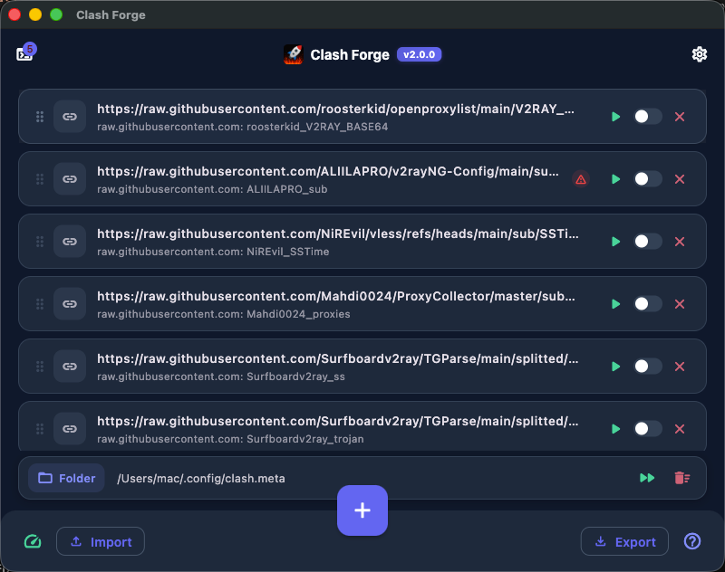
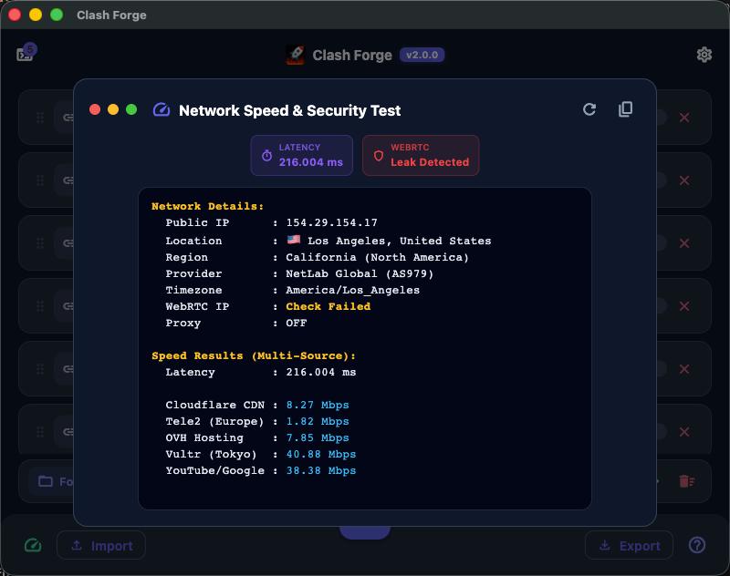
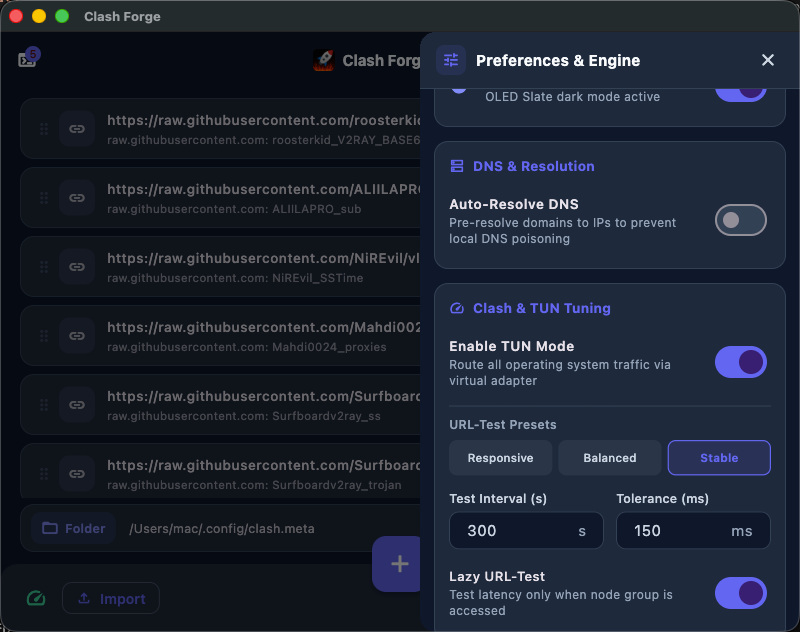
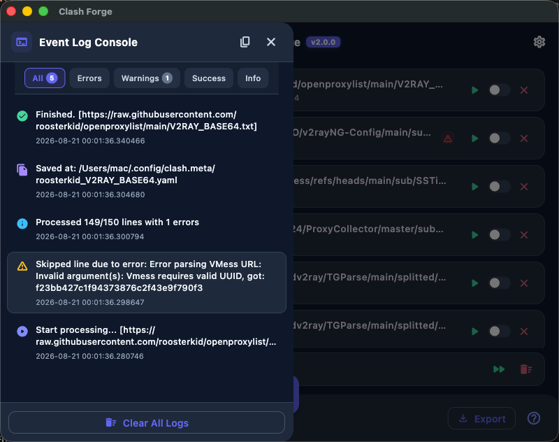

# Clash Forge

**A streamlined subscription forge and proxy profile orchestrator for Clash.**

---

## Overview

**Clash Forge** simplifies proxy configuration management into a clean, visual workflow. Rather than manually editing configuration files or juggling disconnected proxy links, Clash Forge automatically retrieves, validates, and transforms your subscriptions into structured profiles ready for Clash.

With one-click profile activation, real-time connection latency testing, smart DNS resolution, and built-in network audits, Clash Forge provides comprehensive control over your proxy setup within a native macOS interface.

---

## Key Features

- **Instant Profile Switching**  
  Activate any profile directly with a single click. Clash Forge updates your active profile in Clash and provides live connection latency indicators (Green, Amber, Red).

- **Draggable Sorting and File Drop**  
  Reorder your subscriptions by dragging them into your preferred sequence. Import new configurations by dropping files directly into the application window.

- **Universal Protocol Support**  
  Built-in support for all standard proxy protocols:
  - VLESS, VMess, Trojan, Hysteria 2, TUIC, AnyTLS, Shadowsocks, ShadowsocksR, and WireGuard.
  - Accepts standard subscription links (`https://`), individual proxy URIs, and local configuration files.

- **Speed Testing and WebRTC Privacy Audit**  
  Measure throughput and ping across multiple parallel streams, and verify that your network connections remain protected against WebRTC leaks.

- **Smart DNS Resolution**  
  Automatically resolve proxy domains to verified IP addresses using trusted DNS-over-HTTPS providers (DNSPub, Tencent, Cloudflare, Google, CNNIC) to prevent local DNS interference.

- **Native macOS Design**  
  Designed for macOS with clean Light and Dark OLED themes, smooth transitions, and organized settings drawers.

---

## Visual Overview

| **Main Workspace** | **Speed Test & Privacy Audit** |
| :---: | :---: |
|  |  |
| **Preferences & DNS Configuration** | **Activity & Event Logs** |
|  |  |

---

## Quick Start

1. **Add Subscriptions**: Paste a subscription link, enter a proxy URI, or drag a configuration file into the window.
2. **Select Output Folder**: Set your target Clash configuration directory in the bottom control bar.
3. **Build and Activate**: Click **Process All** to generate your YAML profiles, or toggle the switch next to any subscription to activate it in Clash.

---

## Installation

1. Download the latest release from the [GitHub Releases](https://github.com/activebook/clash_forge/releases) page.
2. Open the downloaded `.dmg` or `.app` bundle on macOS.
3. Drag **Clash Forge** into your `Applications` folder.

**Requirements**: macOS 10.15 (Catalina) or later (compatible with Apple Silicon and Intel).

---

## License

This project is licensed under the Apache License 2.0. See the [LICENSE](LICENSE) file for details.
