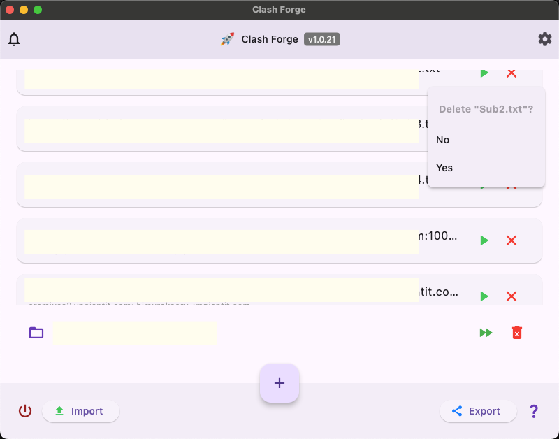
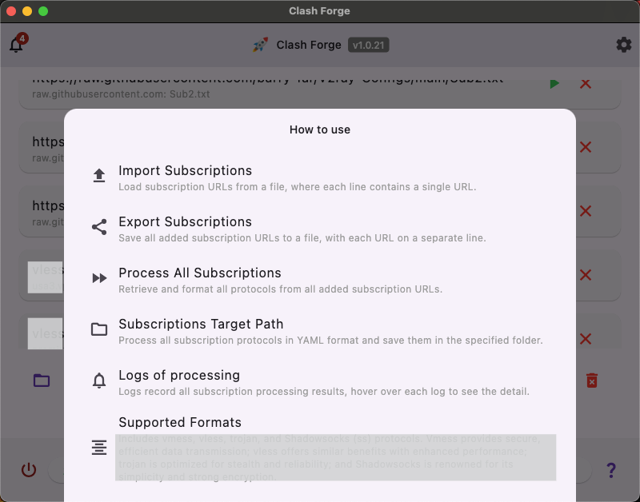
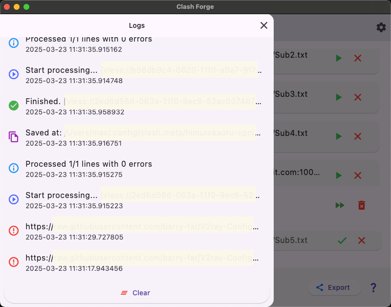

# Clash Forge

**Clash Forge** is a powerful and user-friendly tool designed to streamline the management of proxy configurations for [Clash], a popular rule-based proxy client. Whether you have Clash subscriptions or individual proxy URLs, Clash Forge converts them into Clash-compatible YAML configuration files with ease. It automates tedious tasks, resolves DNS blocks, and provides clear feedback, making proxy setup a breeze.

## Features

### Core Functionality
- **Convert Subscriptions**: Transform multiple Clash subscriptions into individual YAML config files.
- **Direct Config Placement**: Generate config files straight into your Clash config folder for immediate use.
- **Profile Switcher**: Instantly switch between different Clash configurations with a single click. The app reads and updates ClashX Meta's active profile directly.
- **Import/Export**: Save and share your subscription lists with import and export functionality.
- **Clear Logs**: Provides detailed logs of the conversion process for transparency and troubleshooting.

### Protocol Support
- **Comprehensive Protocol Coverage**: Supports all modern proxy protocols:
  - VMess, VLESS, Shadowsocks (SS), ShadowsocksR (SSR), Trojan, **Hysteria2**, **TUIC**, **AnyTLS**
  - **WireGuard** configurations (ClashX Meta compatible)
- **Multiple Input Formats**: Accepts subscription URLs (`https://`), individual proxy URLs (`vmess://`, `vless://`, `ss://`, `ssr://`, `trojan://`, `hysteria2://`, `hy2://`, `tuic://`, `anytls://`), and local configuration files.

### Smart DNS Resolution
- **Automatic DNS Resolution**: Bypass DNS blocks by automatically resolving proxy server domains to IP addresses.
- **China-Friendly DNS Providers**: Prioritizes reliable DNS-over-HTTPS providers that work well in restrictive networks.

### Enhanced User Experience
- **Drag-and-Drop Support**: Simply drag local configuration files into the app to import them instantly.
- **Missing File Alerts**: Visual warnings for local file subscriptions that no longer exist, helping you keep your list clean.
- **Dark Mode Support**: Seamlessly adapts to your system's appearance preferences.
- **System Network Proxy Support**: Enables the use of system-level proxies to improve connectivity.
- **Real-time Validation**: Instant feedback on URL and file path validity as you type.

## Installation

1. **Download**: Get the latest release from the [GitHub repository](https://github.com/activebook/clash_forge/releases)
2. **Supporting OS**: Right now macOS support only. (Using swift code for system network proxy)

## Screenshots

### Main Dashboard

*The main dashboard

### Network Speedtest

*Network speedtest*

### How to use
 
*How to use*

### Logs
 
*Logs*

### Settings
 
*Settings*
